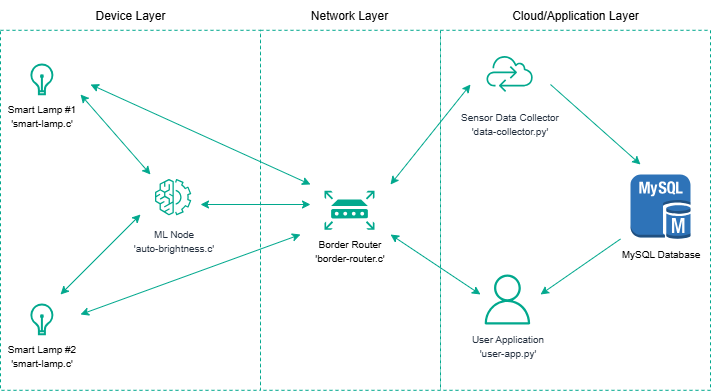

# Efficient Office Lighting
## My IoT project, developed for the Internet of Things course.
---
 

---

It's an IoT application that takes place in an office: every desk lamp is an IoT node that asks the machine learning node what brightness level should have in order to keep a comfortable lighting for the worker.

Each lamp has a lighting sensor that sense the current ambient lightining, measured in lux. 

The sampled ambient lux value is then sent as a CoAP request to the ml node (along with the desired brightness level) that answers with the brightness level the lamp should have.

The ML node runs a simple Decision Tree Regression model, chosen because it's a suitable solution for constrained devices, extracted from a bigger model trained on the laptop, using the TinyML python package.

The application comprises also three python file: a machine learning model creation, training and extraction file; a Data Collector that periodically saves in a MySQL table the informations requested via CoAP to the desk lamps; a Cloud Application that by sending CoAP requests and MySQL queries, allows the user to manage the lamps and inspect the data produced by the IoT devices.
